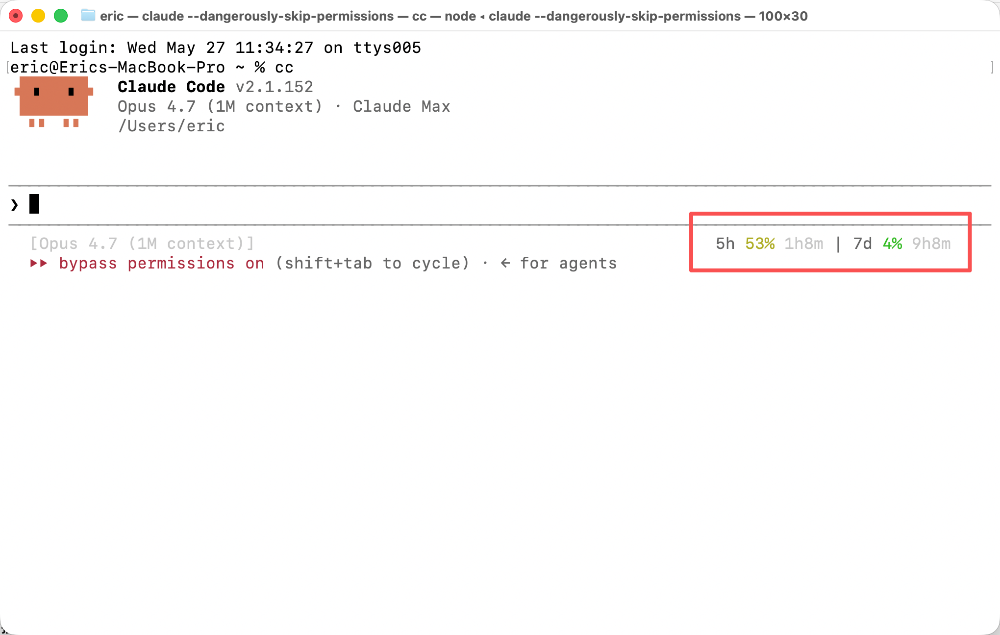

# cc-usage-statusline

A [Claude Code](https://claude.com/claude-code) status line that shows your **5-hour** and **7-day** rate-limit usage on the right, plus the model name and context-window usage on the left.

## Preview



- **Left** — model name + context-window % (the same info cc shows by default).
- **Right** — 5h / 7d utilization with reset countdowns, right-aligned and color-coded:
  - green `< 50%`, yellow `50–79%`, red `>= 80%`.
  - reset countdowns: the 5-hour shows hours+minutes (e.g. `4h39m`); the 7-day shows days+hours (e.g. `6d8h`), falling back to hours+minutes when under a day.

Example right segment: `5h 7% 4h39m | 7d 6% 6d8h`.

All data comes from the JSON Claude Code passes to the status line command on stdin. **No network calls, no credentials, no cache.**

## Requirements

- Claude Code (tested on v2.1.x — relies on the `rate_limits` field in the status line stdin payload).
- `jq`
- macOS or Linux, with `bash`.

## Install

```bash
git clone https://github.com/Tespera/cc-usage-statusline.git
cd cc-usage-statusline
./install.sh
```

Then restart Claude Code (or open a new window).

The installer copies the script to `~/.claude/scripts/` and sets the `statusLine` field in `~/.claude/settings.json`. Your existing settings are backed up first; only `statusLine` is replaced.

To change how often the line refreshes (default 1s):

```bash
REFRESH_INTERVAL=5 ./install.sh
```

## Uninstall

```bash
./uninstall.sh
```

Removes the `statusLine` entry (only if it points at this script) and deletes the script. Settings are backed up first.

## Manual install

If you'd rather not run the installer:

1. Copy `cc-usage-statusline.sh` to `~/.claude/scripts/` and `chmod +x` it.
2. Add this to `~/.claude/settings.json` (merge with whatever you already have):

   ```json
   {
     "statusLine": {
       "type": "command",
       "command": "/absolute/path/to/.claude/scripts/cc-usage-statusline.sh",
       "refreshInterval": 1
     }
   }
   ```

## Customize

Edit the tunables at the top of the script:

| Variable | Default | Meaning |
|---|---|---|
| `WARN` | `50` | percent at which the number turns yellow |
| `CRIT` | `80` | percent at which the number turns red |
| `RIGHT_MARGIN` | `6` | columns kept free on the right for cc's own notifications |

## How it works / limitations

- Claude Code runs the status line command on each render and pipes a JSON blob to it on stdin. This script reads `rate_limits`, `model`, and `context_window` from that blob.
- The status line command has **no controlling tty**, so terminal width is resolved via the parent (cc) process's tty. If that fails it falls back to `$COLUMNS`, then 80.
- cc trims leading whitespace from status line output, so a zero-width U+2060 anchor is prepended to keep the right-alignment padding intact.
- cc reserves the far-right of the row for its own transient notifications (clipboard hints, auto-update messages, etc.); `RIGHT_MARGIN` leaves room so they don't collide.

**Known quirks (these are cc behavior, not bugs in this script):**

- **Different windows can show slightly different numbers.** Each window renders with the `rate_limits` snapshot cc handed it at its last render; cc fetches independently per session, and the 5h window is a rolling window, so values drift between windows.
- **Numbers may differ from `/usage`.** `/usage` computes live when you run it; the status line shows the (slightly lagging) value cc cached in the stdin payload.

## License

MIT
